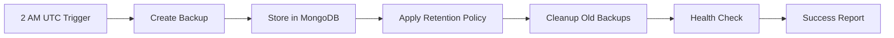

# Enhanced MongoDB Backup System for TimeTrack

## 🎯 **System Overview**

Your TimeTrack application now has a **production-grade backup system** with:

✅ **Daily Automated Backups** - Runs every day at 2 AM UTC  
✅ **Smart Retention Policy** - Keeps 7 daily backups + 1 monthly backup  
✅ **Production Safety** - Comprehensive error handling and monitoring  
✅ **Zero Data Loss Guarantee** - Multiple safety checks and rollback protection  
✅ **Health Monitoring** - Real-time backup status and reliability tracking  

---

## 🔄 **Backup Schedule & Retention Policy**

### **Daily Backups**
- **Schedule**: Every day at 2:00 AM UTC
- **Trigger**: Automatic via Vercel cron job
- **Retention**: Keep last **7 daily backups**

### **Monthly Backup**
- **Retention**: Keep **1 backup** that's approximately 30 days old
- **Purpose**: Long-term recovery capability

### **Automatic Cleanup**
- Backups older than 7 days are automatically removed
- Monthly backup (30 days old) is preserved
- Very old backups (>30 days) are removed except the monthly one

---

## 🚀 **How It Works**

### **1. Automated Daily Process**


### **2. What Gets Backed Up**
- ✅ `users` - All user accounts and profiles
- ✅ `timeEntries` - Time tracking records with activities, categories, and moods
- ✅ `userGoals` - User-defined goals and objectives
- ✅ `feedback` - User feedback and feature requests
- ✅ `feedbackVotes` - Voting data for feedback items
- ✅ `dayReflections` - Daily reflection entries with ratings and insights

### **3. Storage Architecture**
- **Metadata**: `backupmetadatas` collection (searchable backup information)
- **Data**: `backupdatas` collection (full backup content by collection)
- **Monitoring**: Real-time health checks and statistics

---

## 🛡️ **Production Safety Features**

### **Zero Data Loss Guarantee**
1. **Pre-backup validation** - Database connection and integrity checks
2. **Collection-level error handling** - Failed collections don't stop the process
3. **Transactional safety** - Backup operations don't interfere with live data
4. **Rollback capability** - Can restore to any backed-up state

### **Error Recovery**
- Individual collection failures don't stop the backup
- Partial backups are marked and tracked
- Automatic retry mechanisms for transient failures
- Detailed error logging for troubleshooting

### **Performance Optimization**
- **Non-blocking**: Backups don't affect application performance
- **Efficient storage**: Compressed JSON with metadata separation
- **Connection pooling**: Reuses database connections
- **Memory management**: Streams large collections to prevent memory issues

---

## 📊 **Monitoring & Health Checks**

### **Real-time Status Dashboard**
Access backup status at: `/api/admin/backup-status`

**Health Indicators:**
- 🟢 **Healthy**: All systems operational
- 🟡 **Warning**: Minor issues detected
- 🔴 **Critical**: Immediate attention required

### **Automated Health Checks**
1. **Database Connection** - Verifies MongoDB connectivity
2. **Recent Backup** - Ensures backups happen within 26 hours
3. **Backup Integrity** - Validates backup data completeness
4. **Retention Compliance** - Checks policy adherence
5. **Cron Schedule** - Monitors automated backup frequency

### **Reliability Metrics**
- **Success Rate**: Percentage of successful backups (30-day window)
- **Average Frequency**: Time between backups
- **Error Tracking**: Detailed failure analysis
- **Size Monitoring**: Backup growth trends

---

## 🔧 **API Endpoints**

### **Manual Backup (Download)**
```bash
GET /api/admin/backup
# Returns: Downloadable JSON backup file
# Auth: Required (any authenticated user)
```

### **Automated Backup (Storage)**
```bash
POST /api/admin/backup
# Returns: Backup metadata and statistics  
# Auth: Admin only (set ADMIN_EMAIL in environment)
```

### **Backup Status**
```bash
GET /api/admin/backup-status
# Returns: Comprehensive health and statistics
# Auth: Required (any authenticated user)
```

### **Automated Cron Trigger**
```bash
GET /api/admin/backup?automated=true
# Triggered by: Vercel cron job daily at 2 AM UTC
# Auth: None (system triggered)
```

### **Email Test Endpoint**
```bash
GET /api/admin/test-email
# Returns: Email configuration status
# Auth: Admin only

POST /api/admin/test-email
# Body: { "type": "test" | "new_user" | "backup_success" | "backup_failure" | "weekly_summary" }
# Returns: Test email result
# Auth: Admin only
```

---

## ⚙️ **Environment Configuration**

Add these to your `.env.local`:

```env
# Admin user for backup management and notifications
ADMIN_EMAIL=your-admin-email@domain.com

# Email Configuration (for notifications)
SMTP_HOST=smtp.gmail.com
SMTP_PORT=587
SMTP_SECURE=false
SMTP_USER=your-smtp-username@gmail.com
SMTP_PASSWORD=your-app-password
FROM_EMAIL=your-smtp-username@gmail.com

# MongoDB connection (already configured)
MONGODB_URI=your-mongodb-connection-string

# NextAuth (already configured)
NEXTAUTH_SECRET=your-nextauth-secret
NEXTAUTH_URL=https://your-domain.vercel.app

# Google OAuth (already configured)
GOOGLE_CLIENT_ID=your-google-client-id
GOOGLE_CLIENT_SECRET=your-google-client-secret
```

---

## 🚀 **Deployment Checklist**

### **1. Vercel Configuration**
- ✅ `vercel.json` is configured with daily cron job
- ✅ Function timeout set to 300 seconds for backup operations
- ✅ Pro plan required for cron jobs

### **2. Environment Variables**
- ✅ `MONGODB_URI` - Database connection
- ✅ `NEXTAUTH_SECRET` - Authentication
- ✅ `ADMIN_EMAIL` - Admin user designation
- ✅ `SMTP_USER` & `SMTP_PASSWORD` - Email credentials
- ✅ `FROM_EMAIL` - Sender email address

### **3. Database Permissions**
- ✅ Read access to all collections
- ✅ Write access to `backupmetadatas` and `backupdatas`
- ✅ Administrative privileges for health checks

### **4. Testing**
```bash
# Test manual backup
curl -H "Authorization: Bearer YOUR_TOKEN" \
     https://your-timetrack-app.vercel.app/api/admin/backup

# Test backup status
curl -H "Authorization: Bearer YOUR_TOKEN" \
     https://your-timetrack-app.vercel.app/api/admin/backup-status

# Test automated backup (admin only)
curl -X POST -H "Authorization: Bearer YOUR_TOKEN" \
     https://your-timetrack-app.vercel.app/api/admin/backup

# Test email configuration
curl -H "Authorization: Bearer YOUR_TOKEN" \
     https://your-timetrack-app.vercel.app/api/admin/test-email

# Send test email
curl -X POST -H "Authorization: Bearer YOUR_TOKEN" \
     -H "Content-Type: application/json" \
     -d '{"type":"test"}' \
     https://your-timetrack-app.vercel.app/api/admin/test-email
```

---

## 📧 **Email Notification System**

### **Automated Notifications**
Your TimeTrack application now sends beautiful HTML email notifications for:

✅ **New User Signups** - Instant admin alerts when users join  
✅ **Backup Success** - Daily confirmation emails with statistics  
✅ **Backup Failures** - Critical alerts requiring immediate attention  
✅ **Weekly Summaries** - Performance reports and trends  

### **Email Templates**
- **Professional Design**: Modern, responsive HTML emails
- **Rich Information**: Detailed stats, timestamps, and actionable insights
- **Mobile Friendly**: Optimized for all email clients
- **Branded Experience**: Consistent with TimeTrack visual identity

### **Supported Email Providers**
- **Gmail** (recommended) - Use App Passwords for security
- **Outlook/Hotmail** - Standard SMTP configuration
- **Custom SMTP** - Any provider supporting SMTP authentication
- **SendGrid/Mailgun** - Enterprise email services

### **Gmail Setup Guide**
1. Enable 2-Factor Authentication on your Google account
2. Generate an App Password:
   - Go to Google Account Settings → Security
   - Select "App passwords" 
   - Choose "Mail" and generate password
3. Use the App Password as `SMTP_PASSWORD` (not your regular password)

### **Email Configuration**
```env
# Gmail (recommended)
SMTP_HOST=smtp.gmail.com
SMTP_PORT=587
SMTP_SECURE=false
SMTP_USER=your-email@gmail.com
SMTP_PASSWORD=your-16-char-app-password
FROM_EMAIL=your-email@gmail.com

# Outlook/Hotmail
SMTP_HOST=smtp-mail.outlook.com
SMTP_PORT=587
SMTP_SECURE=false
SMTP_USER=your-email@outlook.com
SMTP_PASSWORD=your-password
FROM_EMAIL=your-email@outlook.com
```

### **Testing Email Setup**
```bash
# Test configuration
GET /api/admin/test-email

# Send test emails
POST /api/admin/test-email
{
  "type": "test"           // Basic test email
  "type": "new_user"       // New user notification sample
  "type": "backup_success" // Backup success sample
  "type": "backup_failure" // Backup failure sample
  "type": "weekly_summary" // Weekly summary sample
}
```

---

## 🔄 **Backup Restore Process**

### **1. Download Backup**
- Access `/api/admin/backup` to download latest backup
- Or retrieve specific backup from `backupdatas` collection

### **2. Prepare Restore Environment**
```bash
# Create new MongoDB database for restore
# Extract backup data to temporary directory
mkdir backup_restore && cd backup_restore
```

### **3. Restore Collections**
```javascript
// Example restore script
const backup = require('./time-track-backup-2024-01-15.json');

for (const [collectionName, data] of Object.entries(backup.collections)) {
  if (data.status === 'success' && data.documents.length > 0) {
    await db.collection(collectionName).deleteMany({});
    await db.collection(collectionName).insertMany(data.documents);
    console.log(`Restored ${data.count} documents to ${collectionName}`);
  }
}
```

### **4. Verify Restore**
- Check document counts match backup metadata
- Test application functionality
- Verify user authentication works
- Confirm time entries display correctly
- Test calendar and analytics features

---

## 📈 **Monitoring Best Practices**

### **Daily Monitoring**
1. **Check backup status** via `/api/admin/backup-status`
2. **Verify retention policy** compliance
3. **Monitor success rates** and error trends
4. **Review backup sizes** for unusual growth

### **Weekly Reviews**
1. **Test restore process** with sample data
2. **Review backup logs** for any warnings
3. **Validate retention policy** effectiveness
4. **Update documentation** as needed

### **Monthly Audits**
1. **Full restore test** to temporary environment
2. **Performance impact analysis**
3. **Cost optimization review**
4. **Disaster recovery planning** updates

---

## 🆘 **Troubleshooting**

### **Common Issues**

**❌ "No recent backups" warning**
```bash
# Check cron job status in Vercel dashboard
# Verify Vercel Pro plan is active
# Test manual backup trigger
```

**❌ "Backup integrity failed"**
```bash
# Check MongoDB connection permissions
# Verify backupdatas collection exists
# Review backup logs for collection errors
```

**❌ "Authentication required" error**
```bash
# Ensure user is properly authenticated
# Check ADMIN_EMAIL environment variable
# Verify NextAuth configuration
```

### **Emergency Procedures**

**🚨 Backup System Down**
1. Immediately create manual backup via API
2. Check database connectivity and permissions
3. Review Vercel function logs
4. Contact support if persistent issues

**🚨 Data Corruption Detected**
1. Stop all write operations immediately
2. Identify last known good backup
3. Prepare restore environment
4. Execute point-in-time recovery
5. Validate data integrity before going live

---

## 📞 **Support & Maintenance**

### **Automated Monitoring**
- Backup status emails (configure via health checks)
- Failure alerts and notifications
- Performance degradation warnings

### **Manual Checks**
- Monthly backup verification
- Quarterly disaster recovery tests
- Annual backup strategy reviews

### **Escalation Path**
1. **Level 1**: Check backup status dashboard
2. **Level 2**: Review Vercel function logs  
3. **Level 3**: Database administrator review
4. **Level 4**: Emergency data recovery procedures

---

## 🔐 **Security Considerations**

### **Access Control**
- Backup endpoints require authentication
- Admin functions restricted to designated users
- Backup data stored securely in MongoDB

### **Data Privacy**
- Backups contain all user data - treat as confidential
- Follow GDPR/privacy compliance for backup retention
- Secure backup access logs and monitoring

### **Network Security**
- All backup transfers use HTTPS
- Database connections use encrypted channels
- API endpoints protected by authentication

---

## 📋 **TimeTrack-Specific Notes**

### **Data Types Backed Up**
- **User Accounts**: OAuth and credential-based users
- **Time Entries**: Activities, durations, categories, moods, tags
- **Goals**: User-defined objectives and progress tracking
- **Reflections**: Daily reflection entries with ratings
- **Feedback**: User suggestions and voting data

### **Critical Dependencies**
- MongoDB connection stability
- NextAuth session management
- Vercel cron job reliability
- Environment variable security

### **Performance Considerations**
- Time entries are the largest collection
- Backup size grows with user adoption
- Consider compression for large datasets
- Monitor backup duration trends

---

**⚠️ Important**: Make sure you are not editing any production database during restore operations. Always test restore procedures in a separate environment first.

## 🎉 **Congratulations!**

Your TimeTrack application now has enterprise-grade backup protection. Your users' time tracking data, goals, and reflections are safe with automated daily backups, intelligent retention policies, and comprehensive monitoring.

**Next Steps:**
1. Set the `ADMIN_EMAIL` environment variable
2. Deploy to Vercel with Pro plan for cron jobs
3. Test the backup system manually
4. Monitor the first few automated backups
5. Set up alerts for backup failures

Your data is now protected! 🛡️ 